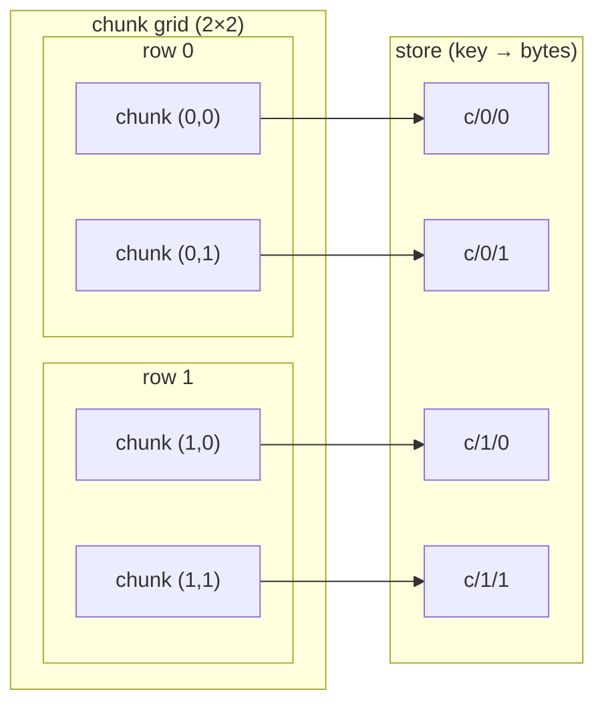
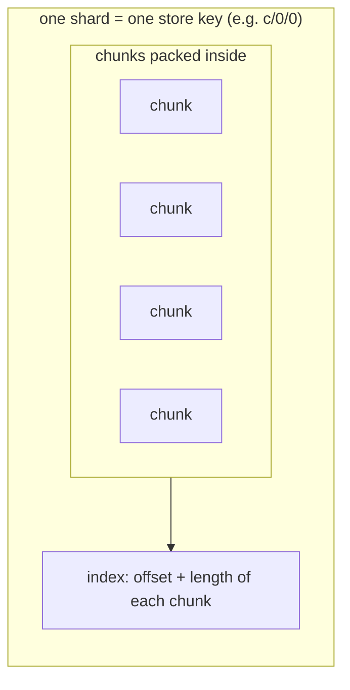
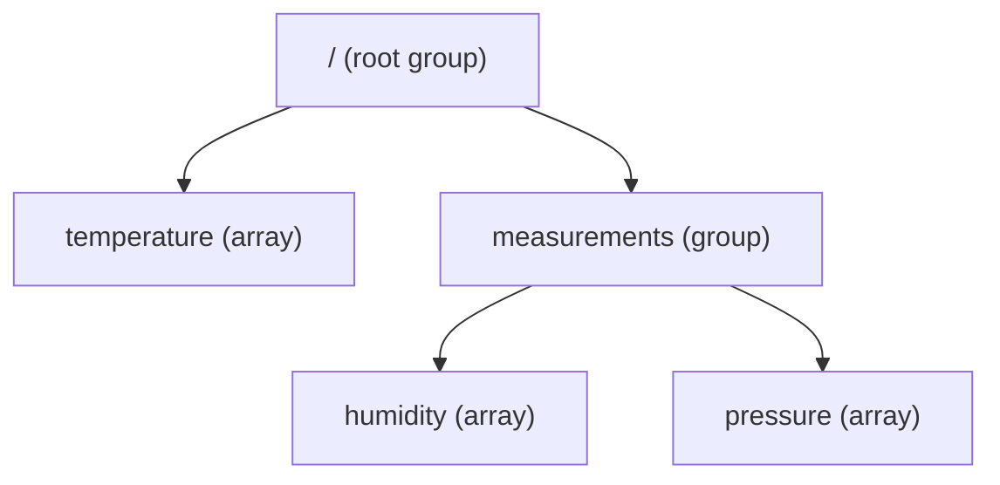
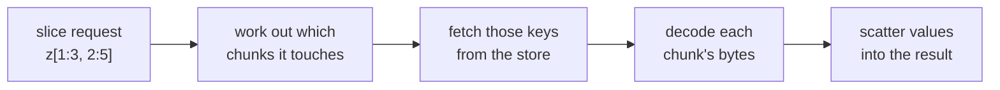

# From Zero to Zarr

*From a NumPy array to stored bytes, chunk by chunk.*

This page is for people who are new to Zarr. You don't need to know NumPy, HDF5,
or anything about file formats. We begin with *why* Zarr exists, then build up
the *how* one idea at a time, until you understand **how Zarr stores an array**,
**why** that layout is defined by a written specification, and **how a library
turns those stored bytes back into an array you can use**.

The page comes in three parts:

- **Part I: The core idea.** The happy path, with pictures and no code.
- **Part II: Under the hood.** A few deeper sections that go *off* the happy
  path. Each one is signposted, so you can read on or skip ahead.
- **Part III: Seeing it for real.** A short hands-on section with runnable
  code that ties everything together.

But before the *how*, a word on the *why*.

---

## Why we need Zarr

Across science and industry, our instruments and simulations have become
extraordinary firehoses of numbers. A satellite streams images of the Earth; a
microscope captures gigapixel scans; a gene sequencer reads thousands of genomes;
a climate model writes out temperature and wind for every point on the globe, hour
after hour. In each case the result has the same shape: a vast grid of numbers —
far more than fits in any single computer's memory, and often arriving as a
continuous stream.

That data is worth little sitting on one machine. It has to be stored somewhere
**durable** and **shareable**, so that many people — often scattered across the
world — can read and analyze it. Increasingly that somewhere is **cloud object
storage** (such as Amazon S3, Google Cloud Storage, or Azure Blob Storage): cheap,
effectively unlimited, and reachable from anywhere. But sheer size makes this
hard: nobody wants to download terabytes just to inspect one corner. What's needed
is a way to store these giant grids so a reader can efficiently and cheaply fetch
**just the piece they want**.

Zarr was built to solve exactly this — though, interestingly, it didn't begin with
the cloud. It grew out of **genomics**. Around 2015, Alistair Miles needed to
analyze arrays of genetic variation across thousands of malaria-carrying mosquitoes
(the [*Anopheles gambiae* 1000 Genomes Project](https://www.malariagen.net/)) —
arrays far too big to fit in memory. His real frustration was *speed*, and to see
why, it helps to understand two things the array formats of the day were already
doing.

First, **chunking**. To store an array bigger than memory, formats like HDF5 and
netCDF already split it into blocks — *chunks* — and compress each one. That's what
lets you read part of an array without loading all of it: you only fetch and
decompress the chunks that cover the part you want. None of this is Zarr's invention — chunking
and compression were well-established ideas, and Zarr deliberately reuses them. The
catch with the existing tools was *speed*: **decompression takes CPU work**, and for
a big analysis that scans millions of values, that work adds up fast.

Here's where speed came in. Reading a chunk means decompressing it, so reading
*many* chunks is a pile of independent decompression jobs — exactly the kind of
work you'd want to spread across all your CPU cores at once. But the tools of the
day wouldn't let him: reading through HDF5 held Python's **global interpreter
lock** (the *GIL* — a safeguard that lets only one thread run Python code at a
time, so extra threads just waited their turn), and the other chunked format he
tried could chop an array along only its **first dimension**. But scientific arrays
usually have *several* dimensions — independent axes along which the data is
arranged. Alistair's mosquito data, for instance, was indexed by position along the
genome, by which mosquito was sampled, and by which of the two copies of each
chromosome it came from — three dimensions; a climate dataset might be indexed by
time, latitude, and longitude. His analyses kept needing pieces that cut across
these dimensions, and chunking along just one of them made that painfully slow. One
core did all the work while the remaining cores sat idle.

So he built Zarr. It didn't introduce new storage concepts so much as **recombine
familiar ones** — chunks, compression, metadata — in a way that frees the CPU cores
to work in parallel: cut an array into chunks across **all its dimensions at once**
(not just one), and decompress them concurrently. Now a read becomes many chunk-decompressions running **at the
same time** — across every core on the machine, and with tools like
[Dask](https://www.dask.org/), across many machines — so an analysis that crunches
the whole array finishes in a fraction of the time. (He tells the story in his early
[Zarr blog posts](http://alimanfoo.github.io/2016/05/16/cpu-blues.html).)

Storing data in the cloud came **later**, and turned out to be a superpower:
because each chunk is simply one key/value entry (as we'll see), Zarr maps
naturally onto object storage like S3, which made it a backbone of cloud-native
science. Today Zarr is used far beyond genomics — in **Earth and climate science**
(satellite imagery, weather and climate model output — the
[Pangeo](https://www.pangeo.io/) community), **bio-imaging** (huge microscopy
volumes, via [OME-Zarr](https://ngff.openmicroscopy.org/)), **astronomy**, and
**machine learning** — anywhere people wrestle with large, multi-dimensional grids
of numbers.

Strip away the domain — mosquitoes, galaxies, hurricanes — and the object at the
center is always the same: an **array**, a big grid of numbers. So that's where
we'll begin. In Part I we'll look at what an array is, then at what happens
when one grows too big to fit in memory, and build up from there to how Zarr
stores it.

---

## Part I: The core idea

### A quick array refresher

The thing Zarr stores is an **array**: a grid of values that all share a single
**data type** (almost always shortened to **dtype**, the term we'll use from here
on), arranged by a **shape**.

Here is a small array with **4 rows and 6 columns** of 32-bit integers (we use a
non-square shape on purpose, so "rows" and "columns" are never ambiguous):

<figure>
<table>
<tr><td>0</td><td>1</td><td>2</td><td>3</td><td>4</td><td>5</td></tr>
<tr><td>6</td><td>7</td><td>8</td><td>9</td><td>10</td><td>11</td></tr>
<tr><td>12</td><td>13</td><td>14</td><td>15</td><td>16</td><td>17</td></tr>
<tr><td>18</td><td>19</td><td>20</td><td>21</td><td>22</td><td>23</td></tr>
</table>
<figcaption><code>shape = (4, 6)</code> — 4 rows, 6 columns; <code>dtype = int32</code> — every value is a 32-bit integer.</figcaption>
</figure>

A few terms we'll use throughout:

- **dtype** — every element has the *same* type. Here it's a 32-bit integer, so
  each value takes exactly 4 bytes. A uniform type means the computer knows
  precisely how many bytes each value occupies, and where each one lives.
- **shape** — the size along each dimension. Ours is `(4, 6)`: the first number is
  rows, the second is columns.
- **ndim** — the number of dimensions (axes). Ours is 2. Arrays can be 1-D, 2-D,
  3-D, or more.

#### Why "contiguous memory" matters

That grid is a convenient *picture*. Underneath, the array is **one contiguous
block of memory** — a single run of bytes, with the values laid out **row by row**
(row 0, then row 1, and so on). This is called **row-major**, or **C order** —
"C" because the C programming language lays out arrays this way, and NumPy follows
the same convention by default. The alternative is **column-major**, or **F order**
("F" for Fortran, which stores arrays column by column); a few tools, such as
MATLAB and R, use it. The two simply disagree on which direction to walk the grid
when flattening it into memory. Zarr's default is C order.

<figure>
<table>
<tr>
<td>0</td><td>1</td><td>2</td><td>3</td><td>4</td><td>5</td><td style="opacity:0.5">&hellip;</td><td>18</td><td>19</td><td>20</td><td>21</td><td>22</td><td>23</td>
</tr>
</table>
<figcaption>The same 24 values as they actually sit in memory: row 0 (0–5) comes first, immediately followed by row 1 (6–11), then row 2, then row 3 (18–23) — back to back. (The middle is elided here.)</figcaption>
</figure>

This layout is not just trivia — it has real consequences:

- Reading a **whole row** is fast: the values are already next to each other, so
  it's one smooth sequential scan of memory.
- Reading a **whole column** is slower: the values are far apart (column 0 is at
  positions 0, 6, 12, 18), so the computer has to hop around — a *strided* access
  that is much less friendly to memory and caches.

Keep this in mind. The fact that an array is a contiguous, row-major block is
exactly what Zarr has to wrestle with once we start chopping arrays into pieces.

#### Slicing

To read part of an array, you **slice** it — selecting a rectangular region.
Asking for rows 1–2 and columns 2–4, which Python and NumPy write as `a[1:3, 2:5]`,
picks out the shaded block:

<figure>
<table>
<tr><td>0</td><td>1</td><td>2</td><td>3</td><td>4</td><td>5</td></tr>
<tr><td>6</td><td>7</td><td style="background:var(--md-code-bg-color)"><strong>8</strong></td><td style="background:var(--md-code-bg-color)"><strong>9</strong></td><td style="background:var(--md-code-bg-color)"><strong>10</strong></td><td>11</td></tr>
<tr><td>12</td><td>13</td><td style="background:var(--md-code-bg-color)"><strong>14</strong></td><td style="background:var(--md-code-bg-color)"><strong>15</strong></td><td style="background:var(--md-code-bg-color)"><strong>16</strong></td><td>17</td></tr>
<tr><td>18</td><td>19</td><td>20</td><td>21</td><td>22</td><td>23</td></tr>
</table>
<figcaption><code>a[1:3, 2:5]</code> selects the shaded region (rows 1–2, columns 2–4).</figcaption>
</figure>

That `start:stop` bracket notation is Python and NumPy's; other languages and Zarr
implementations express the same idea with their own syntax (Rust's `s![1..3, 2..5]`,
for instance). The notation isn't part of Zarr — what matters here is the universal
*concept*: picking out a sub-region of the array.

### When an array outgrows memory

The catch with an in-memory array is right there in the name: it lives in memory,
and memory runs out. As we saw, real datasets are routinely **too big to fit in
RAM**, need to **outlive the program that created them**, and must be **shared** so
others can read even a single corner without copying the whole thing.

An array that large is never held in memory all at once — it's written out a piece
at a time (more on that in Part II). To make that possible, Zarr starts with
one simple idea: don't store the array as a single blob. Split it up.

### Chunking: splitting the grid into blocks

To store an array that may be enormous, Zarr first cuts the grid into a
[regular pattern of equal-shaped blocks](https://zarr-specs.readthedocs.io/en/latest/v3/chunk-grids/regular-grid/index.html)
called **chunks**. You choose the **chunk shape** — the shape of one block.

Let's chunk our 4×6 array with a chunk shape of `(2, 3)` — 2 rows by 3 columns.
That divides it evenly into four chunks. Crucially, the chunks aren't a flat list:
they tile the array, so they form a grid of their own — the **chunk grid**. Here
the chunk grid has shape `(2, 2)`: two rows and two columns *of chunks*. Notice the
position labels match the original array — chunk `(0, 1)` sits top-right, holding
the array's top-right block:

<figure>
<div style="display:grid;grid-template-columns:repeat(2, max-content);gap:1rem;justify-content:center">
<div style="text-align:center">
<table><tr><td>0</td><td>1</td><td>2</td></tr><tr><td>6</td><td>7</td><td>8</td></tr></table>
<small>chunk (0, 0)</small>
</div>
<div style="text-align:center">
<table><tr><td>3</td><td>4</td><td>5</td></tr><tr><td>9</td><td>10</td><td>11</td></tr></table>
<small>chunk (0, 1)</small>
</div>
<div style="text-align:center">
<table><tr><td>12</td><td>13</td><td>14</td></tr><tr><td>18</td><td>19</td><td>20</td></tr></table>
<small>chunk (1, 0)</small>
</div>
<div style="text-align:center">
<table><tr><td>15</td><td>16</td><td>17</td></tr><tr><td>21</td><td>22</td><td>23</td></tr></table>
<small>chunk (1, 1)</small>
</div>
</div>
<figcaption>A <code>(4, 6)</code> array with chunk shape <code>(2, 3)</code> forms a <strong>chunk grid</strong> of shape <code>(2, 2)</code>. Don't confuse the two: the <em>chunk shape</em> <code>(2, 3)</code> is the size of each block; the <em>chunk grid shape</em> <code>(2, 2)</code> is how many blocks there are along each axis.</figcaption>
</figure>

Chunking is the key move. Each chunk can be stored, loaded, and compressed on its
own, so a program can read just the chunks it needs — that one corner your
colleague wanted — without touching the rest. (Starting with a chunk shape that
divides the array evenly keeps things simple; we'll look at what happens when it
*doesn't* in Part II.)

### A store is just keys and bytes

Where do the chunks go? Into a **store**. According to the
[Zarr specification](https://zarr-specs.readthedocs.io/en/latest/v3/core/index.html#stores),
a store is simply *a mapping from keys to values* — where a **key** is a text
string and a **value** is a sequence of **bytes**. In other words, a store is
basically a dictionary: hand it a key, get back some bytes.

That abstraction is deliberately humble, because lots of things can play the role
of a store: a **directory on your disk** (keys are file paths), an **object-storage
bucket** like Amazon S3 (keys are object names), a **ZIP file**, or even plain
memory. Zarr treats them all the same way.

Each cell of the **chunk grid** becomes one value in the store, under a key built
from the cell's position. So the 2×2 chunk grid on the left flattens into four
key→bytes entries on the right:



Where does a key like `c/0/1` come from? It's built by a simple, fixed rule (the
default [*chunk key encoding*](https://zarr-specs.readthedocs.io/en/latest/v3/chunk-key-encodings/default/index.html)):
start with the literal prefix **`c`** — short for
"chunk" — then append the chunk's grid indices, one per dimension, separated by `/`.
So the chunk in grid row&nbsp;1, column&nbsp;0 becomes `c/1/0`; for a 3-D array, a
chunk at grid position `(2, 0, 1)` becomes `c/2/0/1`. The separator is configurable
(`.` is the other common choice), and — as we'll see next — the array records which
scheme it uses, so any reader reconstructs exactly the same keys.

That's the whole trick: a big array becomes a handful of key/value entries that
any storage system capable of "save these bytes under this name" can hold.

### Metadata: making the bytes meaningful

A pile of chunk blobs is meaningless on its own. If all you have is the bytes
under `c/0/1`, how would you know they're 32-bit integers, how big the array is,
or how the chunks tile together?

Zarr answers this with **metadata**: a small JSON document, stored in the same
store under the key `zarr.json`, that describes the array. Among its
[fields](https://zarr-specs.readthedocs.io/en/latest/v3/core/index.html#array-metadata):

- [`shape`](https://zarr-specs.readthedocs.io/en/latest/v3/core/index.html#array-metadata-shape) — the array's overall shape, e.g. `[4, 6]`.
- [`data_type`](https://zarr-specs.readthedocs.io/en/latest/v3/core/index.html#array-metadata-data-type) — the dtype, e.g. `int32`.
- [`chunk_grid`](https://zarr-specs.readthedocs.io/en/latest/v3/core/index.html#array-metadata-chunk-grid) — how the array is divided into a regular grid of chunks. Nested
  inside it is the **`chunk_shape`** — the shape of a *single* chunk, e.g.
  `[2, 3]`. (Note the *number* of chunks along each axis — the chunk grid's own
  shape, `2 × 2` here — isn't stored; it's computed from the array shape and the
  chunk shape.)
- [`chunk_key_encoding`](https://zarr-specs.readthedocs.io/en/latest/v3/core/index.html#array-metadata-chunk-key-encoding) — how chunk positions become keys: the `c/0/1` rule just
  described, including the separator used.
- [`fill_value`](https://zarr-specs.readthedocs.io/en/latest/v3/core/index.html#fill-value) — the value for parts of the array that were never written (the
  spec calls these "uninitialised portions"). More on this in Part II.
- [`codecs`](https://zarr-specs.readthedocs.io/en/latest/v3/core/index.html#array-metadata-codecs) — the **codecs** (a *codec* is a coder/decoder: it encodes a chunk's
  values into stored bytes, and decodes them back) used to turn each chunk's values
  into the bytes saved in the store. More on this in Part II.

The metadata is the legend that turns anonymous bytes back into your array. We'll
look at a *real* `zarr.json` in Part III.

### The role of the specification

Here's the part that surprises newcomers: **none of that layout — the `zarr.json`
fields, the `c/0/1` key names, the way chunks are encoded — was invented by any
particular library.** It is defined by the
[**Zarr specification**](https://zarr-specs.readthedocs.io/en/latest/v3/core/index.html),
a written, public standard.

Because the format is specified independently of any one library, **any**
implementation can read and write it. An array written from Python can be read by
an implementation in Rust, JavaScript, or C++, because they all agree on the same
spec. This page's examples use [zarr-python](https://github.com/zarr-developers/zarr-python),
but the same data is understood by [zarrs](https://github.com/zarrs/zarrs)
(Rust), [zarrita.js](https://github.com/manzt/zarrita.js) (JavaScript),
[TensorStore](https://google.github.io/tensorstore/) (C++), and more.

You can read the standard at
[zarr-specs.readthedocs.io](https://zarr-specs.readthedocs.io). These examples use
**Zarr format 3**, the current default. An older format,
[version 2](https://zarr-specs.readthedocs.io/en/latest/v2/v2.0.html), uses a
slightly different on-disk layout; see the [v3 migration guide](v3_migration.md)
if you meet it.

---

## Part II: Under the hood

You now have the core mental model: arrays become chunks, chunks become key/value
entries, and metadata explains it all, exactly as the spec prescribes. The next
few sections go a little deeper, off the happy path. None of it changes the big
picture — it just explains the machinery. Read on if you're curious; skip to
[Part III](#part-iii-seeing-it-for-real) if you'd rather see it in action.

### Going deeper: how chunks meet memory

Remember that an array lives in memory as one contiguous, row-major block. Here's
the catch: **the values belonging to a single chunk are *not* next to each other
in that block.**

Look again at chunk `(0, 0)` — values `0, 1, 2, 6, 7, 8`. In the array's flat
memory, those sit in two separate runs, because columns 3, 4, 5 of each row fall
in between:

<figure>
<table>
<tr>
<td style="background:var(--md-code-bg-color)"><strong>0</strong></td><td style="background:var(--md-code-bg-color)"><strong>1</strong></td><td style="background:var(--md-code-bg-color)"><strong>2</strong></td><td>3</td><td>4</td><td>5</td><td style="background:var(--md-code-bg-color)"><strong>6</strong></td><td style="background:var(--md-code-bg-color)"><strong>7</strong></td><td style="background:var(--md-code-bg-color)"><strong>8</strong></td><td>9</td><td>10</td><td>11</td><td>12</td><td>…</td>
</tr>
</table>
<figcaption>Chunk (0, 0)'s values (shaded) are split into two runs in the array's flat memory — columns 3–5 lie in between.</figcaption>
</figure>

So writing a chunk isn't a straight copy. Zarr must **gather** the chunk's
scattered values into the chunk's *own* small contiguous block, then encode and
store it. Reading does the reverse: decode the chunk into its compact block, then
**scatter** the values back into the right positions of your result array.

<figure>
<table style="margin:0 auto;text-align:center">
<tr>
<td style="background:var(--md-code-bg-color)"><strong>0</strong></td><td style="background:var(--md-code-bg-color)"><strong>1</strong></td><td style="background:var(--md-code-bg-color)"><strong>2</strong></td><td style="opacity:0.4">3&nbsp;&nbsp;4&nbsp;&nbsp;5</td><td style="background:var(--md-code-bg-color)"><strong>6</strong></td><td style="background:var(--md-code-bg-color)"><strong>7</strong></td><td style="background:var(--md-code-bg-color)"><strong>8</strong></td>
</tr>
</table>
<div style="text-align:center"><small>in the array — chunk (0,0)'s values, split apart by the in-between cells (3, 4, 5)</small></div>
<div style="text-align:center;margin:0.5rem 0"><strong>gather &darr; when writing</strong> &nbsp;&middot;&nbsp; <strong>scatter &uarr; when reading</strong></div>
<table style="margin:0 auto;text-align:center">
<tr>
<td style="background:var(--md-code-bg-color)"><strong>0</strong></td><td style="background:var(--md-code-bg-color)"><strong>1</strong></td><td style="background:var(--md-code-bg-color)"><strong>2</strong></td><td style="background:var(--md-code-bg-color)"><strong>6</strong></td><td style="background:var(--md-code-bg-color)"><strong>7</strong></td><td style="background:var(--md-code-bg-color)"><strong>8</strong></td>
</tr>
</table>
<div style="text-align:center"><small>in the chunk — one contiguous block, which is what gets encoded and stored</small></div>
<figcaption><strong>Gather and scatter.</strong> Writing collects the chunk's scattered values into its own contiguous block (gather); reading runs the mapping in reverse, placing decoded values back at their strided positions in the array (scatter).</figcaption>
</figure>

This gather/scatter isn't stated in the spec — it's a direct **consequence** of
two spec rules working together: chunks form a
[regular grid](https://zarr-specs.readthedocs.io/en/latest/v3/chunk-grids/regular-grid/index.html),
and a chunk's values are
[serialized in row-major order](https://zarr-specs.readthedocs.io/en/latest/v3/codecs/bytes/index.html).
Two practical effects follow, and they're worth remembering when you choose a chunk
shape:

- **Reading amplifies.** To return a slice, Zarr reads *every chunk the slice
  touches*, decodes each one **completely**, and then extracts the part you asked
  for. Ask for a single value in a million-element chunk, and the whole chunk is
  still read and decoded.
- **Unaligned writing is expensive.** If you write a region that doesn't line up
  with chunk boundaries, Zarr must first **read** the affected edge chunks,
  **modify** the overlapping part, and **write** them back — a *read-modify-write*.
  Writing whole, chunk-aligned regions avoids that round trip.

### Going deeper: when chunks don't divide evenly

Our 4×6 array split cleanly into 2×3 chunks. Real arrays rarely cooperate. What if
the array has **5 rows** and we keep a chunk height of **2**?

The chunk grid simply rounds up: 5 rows with a chunk height of 2 gives row-chunks
covering rows 0–1, 2–3, and 4. That last row-chunk only has *one* real row, but —
per the [spec](https://zarr-specs.readthedocs.io/en/latest/v3/chunk-grids/regular-grid/index.html) —
**border chunks are always stored at full size**. The cells beyond the array's edge
are unused; the spec *recommends* writing the **fill value** into them.

<div style="display:flex;flex-wrap:wrap;gap:1rem">
<figure>
<table><tr><td>24</td><td>25</td><td>26</td></tr><tr><td style="opacity:0.45">fill</td><td style="opacity:0.45">fill</td><td style="opacity:0.45">fill</td></tr></table>
<figcaption>bottom chunk (2, 0)</figcaption>
</figure>
<figure>
<table><tr><td>27</td><td>28</td><td>29</td></tr><tr><td style="opacity:0.45">fill</td><td style="opacity:0.45">fill</td><td style="opacity:0.45">fill</td></tr></table>
<figcaption>bottom chunk (2, 1)</figcaption>
</figure>
</div>

So a 5×6 array chunked at `(2, 3)` quietly stores a row of "phantom" cells holding
the fill value. It's harmless, but it's a small waste — and a good reason to pick a
chunk shape that fits your array's real shape reasonably well. (For practical
guidance on choosing chunk shapes, see [Performance](performance.md).)

### Going deeper: codecs (how values become bytes)

One more thing happens inside each chunk. The bytes stored under `c/0/1` aren't
necessarily the raw values — they're produced by a **codec pipeline**, a small
ordered assembly line recorded in the metadata. The
[specification](https://zarr-specs.readthedocs.io/en/latest/v3/core/index.html#codecs)
defines three kinds of codec, applied in this order:

1. **array → array** codecs (optional, any number) — rearrange the values; e.g. a
   [*transpose* codec](https://zarr-specs.readthedocs.io/en/latest/v3/codecs/transpose/index.html)
   changes their order.
2. **array → bytes** codec (exactly one, always required) — turns the array of
   values into a flat sequence of bytes. By default
   ([the `bytes` codec](https://zarr-specs.readthedocs.io/en/latest/v3/codecs/bytes/index.html))
   it writes them in lexicographical order, which the spec notes *is* C / row-major
   order.
3. **bytes → bytes** codecs (optional, any number) — transform the bytes; e.g.
   **compression** to shrink them, or a checksum to detect corruption.

Because the metadata records the exact pipeline, any spec-compliant reader knows
precisely how to run it in reverse and **decode** a chunk back into values.
Per-chunk compression is a big part of why Zarr can store enormous arrays
efficiently while staying readable everywhere.

### Going deeper: sharding (when there are too many chunks)

So far, **each chunk has been its own store object** — one key, one value. That's
simple, but it has a limit: small chunks in a very large array produce a *huge*
number of chunks, and therefore a huge number of files or objects. The spec notes
this is exactly where file systems (block sizes, inode limits) and object stores
(which dislike millions of tiny objects) start to struggle.

**Sharding** is the fix, and it adds one layer to the picture. Instead of writing
every chunk as a separate object, Zarr can pack a block of neighboring chunks into
a single store object called a **shard**. Inside a shard, the chunks are written
one after another, followed by an **index** recording each chunk's byte offset and
length. That index is the clever part: because the store knows exactly where each
chunk sits, a reader can still pull out a *single* chunk without decoding the whole
shard. The chunk shape must divide the shard shape evenly, so a shard always holds
a whole number of chunks. The layering becomes
**array → shards (one object per store key) → chunks**:



!!! note "The shard truth"
    Sharding gives you the best of both worlds — **far fewer objects** in the
    store, but still **fine-grained, single-chunk reads** within them. The one
    thing to keep straight is what now occupies a single store object: *without*
    sharding, one **chunk** is one stored object; *with* sharding, the stored
    object is the **shard**, and chunks become pieces *inside* it. In zarr-python
    you set both shapes explicitly — `chunks=` for the small pieces and `shards=`
    for the bundle. (The formal
    [specification](https://zarr-specs.readthedocs.io/en/latest/v3/codecs/sharding-indexed/index.html)
    calls those small pieces *inner chunks*; this page just calls them chunks — but
    they're the same thing.) You'll also hear *"shards are the unit of writing,
    chunks are the unit of reading"* — handy guidance, though the spec only defines
    the on-disk layout that makes partial reads possible, not a hard rule about
    write granularity.

Where does all this get recorded? Reassuringly, sharding adds **no new metadata
files** — the array still has its single `zarr.json`. Sharding is simply one of the
**codecs** from the previous section: a
[`sharding_indexed`](https://zarr-specs.readthedocs.io/en/latest/v3/codecs/sharding-indexed/index.html)
codec in the array's `codecs` list. The array's chunk shape in `chunk_grid` becomes the *shard* shape
(the unit that maps to one store key), while the *inner* chunk shape sits inside
that codec's own configuration. The shard's **index** — the offsets and lengths
that locate each inner chunk — isn't in `zarr.json` at all; it's written *inside
each shard object itself*, as a small footer (by default at the end). So `zarr.json`
describes *how* shards are built, and every shard then carries its own little map to
the chunks within it.

So in `zarr.json` there's nothing new to learn: sharding is just one more entry in
the array's `codecs` list, a `sharding_indexed` codec that looks roughly like this:

```json
{
  "name": "sharding_indexed",
  "configuration": {
    "chunk_shape": [2, 3],
    "codecs": [ ... ],
    "index_codecs": [ ... ],
    "index_location": "end"
  }
}
```

Two parts are worth recognising. The inner `chunk_shape` is the size of the chunks
packed inside each shard. And `index_location` tells a reader **where in the shard
to find the index** — `"end"` means the footer described above (it can also be
`"start"`). The elided `codecs` and `index_codecs` lists simply record how the
chunks and the index itself are encoded. Because the `sharding_indexed` codec is
part of the **Zarr specification**, any implementation that understands it can open
the shard.

And the index inside a shard is, logically, just a small table — one row per inner
chunk, giving where that chunk starts and how long it is:

<figure>
<table style="margin:0 auto;text-align:center">
<tr><th>inner chunk</th><th>byte offset</th><th>byte length</th></tr>
<tr><td>(0, 0)</td><td>0</td><td>33</td></tr>
<tr><td>(0, 1)</td><td>33</td><td>33</td></tr>
<tr><td>(1, 0)</td><td>66</td><td>33</td></tr>
<tr><td>(1, 1)</td><td>99</td><td>33</td></tr>
</table>
<figcaption>A shard's index (illustrative offsets/lengths). One entry per inner chunk lets a reader fetch just the chunk it wants. The spec defines this index — including that it sits, by default, in a footer at the end of the shard — so every implementation locates a chunk the same way.</figcaption>
</figure>

For the hands-on side of sharding, see
[Sharding in the array guide](arrays.md#sharding).

### Going deeper: groups (organizing many arrays)

Real datasets usually hold more than one array. Because store keys are just
strings, they can contain `/`, which lets Zarr nest things into a **hierarchy** —
much like folders and files. A **group** is a node that can contain arrays and
other groups.



Here's the key insight: there are **no real folders**. The hierarchy is an
illusion created entirely by the **key names**. Every node — each group and each
array — has its own `zarr.json` under a key prefixed by its path, and an array's
chunk keys carry the same prefix. The tree above is just these flat keys in the
store:

```text
zarr.json                              ← root group metadata
temperature/zarr.json                  ← array metadata
temperature/c/0/0                      ← a chunk of "temperature"
temperature/c/0/1
measurements/zarr.json                 ← subgroup metadata
measurements/humidity/zarr.json        ← array metadata
measurements/humidity/c/0/0            ← a chunk of "humidity"
measurements/pressure/zarr.json
measurements/pressure/c/0/0
```

Reading `measurements/humidity` just means looking up the keys that start with that
prefix. So nothing new is needed to support hierarchies: the same simple rules —
keys, bytes, and metadata — scale from a single array up to a richly structured
dataset, and they map just as naturally onto a flat object store (where keys never
were folders) as onto a directory on disk. See [Groups](groups.md) to work with
them.

### Going deeper: more than two dimensions

We've stayed in 2-D to keep the pictures simple, but **nothing about Zarr is limited
to two dimensions** — the whole model scales to any number of axes, with one more
index at each step. An *N*-dimensional array's `shape` and chunk shape each gain an
axis, its chunk grid becomes *N*-dimensional, and each chunk key carries *N*
indices. The store, the metadata, and the codecs are all unchanged.

This matters because real data is *usually* more than 2-D. A short video clip is
3-D (frames × height × width); an RGB image is 3-D (height × width × colour
channel); a microscope scan or a CT volume is a stack of 2-D slices; and a climate
field recorded over time is (time × latitude × longitude). Many datasets have four
or more axes.

To see the generalisation concretely, picture a 3-D array as a **stack of 2-D
arrays**. Here are two copies of our 4×6 grid stacked into a `(2, 4, 6)` array —
think of them as two time steps:

<div style="display:flex;flex-wrap:wrap;gap:1.5rem">
<figure>
<table>
<tr><td>0</td><td>1</td><td>2</td><td>3</td><td>4</td><td>5</td></tr>
<tr><td>6</td><td>7</td><td>8</td><td>9</td><td>10</td><td>11</td></tr>
<tr><td>12</td><td>13</td><td>14</td><td>15</td><td>16</td><td>17</td></tr>
<tr><td>18</td><td>19</td><td>20</td><td>21</td><td>22</td><td>23</td></tr>
</table>
<figcaption>layer 0</figcaption>
</figure>
<figure>
<table>
<tr><td>24</td><td>25</td><td>26</td><td>27</td><td>28</td><td>29</td></tr>
<tr><td>30</td><td>31</td><td>32</td><td>33</td><td>34</td><td>35</td></tr>
<tr><td>36</td><td>37</td><td>38</td><td>39</td><td>40</td><td>41</td></tr>
<tr><td>42</td><td>43</td><td>44</td><td>45</td><td>46</td><td>47</td></tr>
</table>
<figcaption>layer 1</figcaption>
</figure>
</div>

Everything you've already learned carries straight over, just with that extra index:

- **Chunk shape** gains an axis. A chunk shape of `(1, 2, 3)` keeps each layer
  separate (depth 1) and splits each layer into the same 2×3 blocks as before.
- The **chunk grid** is now 3-D: shape `(2, 2, 2)` — two layers × two chunk-rows ×
  two chunk-columns = **eight** chunks.
- **Keys** gain an index. The chunk at grid position `(layer, row, col) = (1, 0, 1)`
  is stored under the key `c/1/0/1`.
- **Slicing** gains an index too: `a[0]` selects the whole first layer, and
  `a[0, 1:3, 2:5]` selects a region within it.

Adding dimensions changes the *numbers* — more entries in the shape, more indices in
each key — but not the *model*. And these higher-dimensional arrays are often
exactly the ones too big for memory, which brings us to the last piece.

### Going deeper: working with data bigger than memory

Back to the question from Part I: how do you handle an array that's too big
for RAM? The answer falls out of everything above. Creating a Zarr array doesn't
allocate the whole thing — it just writes the metadata and prepares an (empty)
store. You then fill the array **a region at a time**, and each write only needs
*that region* in memory:

- read or generate one block of data (say, a few chunks' worth),
- write it to the corresponding slice of the array,
- discard it, and move on to the next block.

Because only one block is ever in memory, the array on disk can be far larger than
your RAM. Writing **chunk-aligned** blocks keeps each write cheap (no
read-modify-write, as we saw earlier). This is also how data streaming in from
instruments or simulations gets persisted: block by block, as it arrives. Tools
like [Dask](https://www.dask.org/) automate this, computing and writing many
chunks in parallel. For the practical recipes, see
[Optimizing performance](performance.md) and [Working with arrays](arrays.md).

---

## Part III: Seeing it for real

Enough concepts — let's watch the machinery run. We'll create the exact `(4, 6)`
array chunked at `(2, 3)` from Part I, then inspect what Zarr actually wrote.

First, create the array:

```python exec="true" session="datamodel"
import shutil

# start clean so the example is reproducible
shutil.rmtree("data/understanding-zarr.zarr", ignore_errors=True)
```

```python exec="true" session="datamodel" source="above" result="code"
from pathlib import Path

import numpy as np
import zarr

z = zarr.create_array(
    store="data/understanding-zarr.zarr",
    shape=(4, 6),
    chunks=(2, 3),
    dtype="int32",
)
print(type(z))
```

Notice what `z` is: a **Zarr array**, *not* a NumPy array. It's a lightweight handle
onto the store — there aren't 24 integers sitting in memory. And `create_array` has
so far written **only metadata**: no chunk data at all. We can prove that by listing
everything in the store:

```python exec="true" session="datamodel" source="above" result="code"
def show_store():
    root = Path("data/understanding-zarr.zarr")
    for path in sorted(root.rglob("*")):
        if path.is_file():
            print(path.relative_to(root))

show_store()
```

Just `zarr.json` — the metadata, and not a single chunk. Here is what it holds:

```python exec="true" session="datamodel" source="above" result="json"
import json

metadata = Path("data/understanding-zarr.zarr/zarr.json").read_text()
print(json.dumps(json.loads(metadata), indent=2))
```

Every concept from Part I is right there: the `shape`, the `chunk_grid` (with
its nested `chunk_shape`), the `data_type`, the `chunk_key_encoding` that produces
`c/0/1`-style keys, the `fill_value`, and the `codecs` pipeline.

The dump also carries a few fields we haven't dwelt on.
[`zarr_format`](https://zarr-specs.readthedocs.io/en/latest/v3/core/index.html#array-metadata-zarr-format)
and
[`node_type`](https://zarr-specs.readthedocs.io/en/latest/v3/core/index.html#array-metadata-node-type)
are housekeeping — the Zarr format version (3) and whether this node is an array or
a group. `attributes` is a slot for your own custom metadata, such as names, units,
or descriptions (see [Attributes](attributes.md)). And
[`storage_transformers`](https://zarr-specs.readthedocs.io/en/latest/v3/core/index.html#storage-transformers)
is an optional, advanced extension point: where a codec transforms an *individual
chunk*, a storage transformer sits between the *whole array* and the store, able to
transform how data is read from and written to it. No storage transformers are
standardised yet, so zarr-python writes an empty list (`[]`) — you can safely ignore
it for now.

Now let's actually store some data. zarr-python deliberately mirrors NumPy's
**indexing and slicing syntax**: you write into the array by assigning to a slice,
just as you would with NumPy. **That assignment is what triggers Zarr to encode
chunks and write their bytes** — creation set up the metadata, but only writing puts
chunk data in the store:

```python exec="true" session="datamodel" source="above" result="code"
# the same 4x6 grid of integers from Part I
source = np.arange(24).reshape(4, 6)

z[:] = source  # assigning to a slice writes chunk bytes to the store

show_store()
```

Now the four chunk values (`c/0/0` … `c/1/1`) have appeared alongside `zarr.json` —
one object per cell of our 2×2 chunk grid, exactly as the diagrams promised. The
metadata was written at creation; the chunk bytes were written only just now, by the
assignment.

Finally, reading — again using ordinary Python indexing. When you ask for a slice,
zarr-python does the reverse of everything in Part II:



It works out which chunks the slice overlaps, fetches only those keys, decodes
their bytes, and scatters the values into the result — which comes back as an
ordinary NumPy array. The round-trip matches the original data:

```python exec="true" session="datamodel" source="above" result="code"
opened = zarr.open_array("data/understanding-zarr.zarr", mode="r")
corner = opened[1:3, 2:5]  # ordinary slicing, just like NumPy
print(corner)
print("matches NumPy:", bool((corner == source[1:3, 2:5]).all()))
```

And here's the real payoff of everything this page has argued. We wrote that store
with zarr-python, but nothing about it is Python-specific: it's just the keys, bytes,
and `zarr.json` that the **specification** prescribes. So the *exact same directory*
can be opened, unchanged, by a Zarr implementation in another language — by
[zarrs](https://github.com/zarrs/zarrs) from Rust, by
[zarrita.js](https://github.com/manzt/zarrita.js) from JavaScript in a browser, or by
[TensorStore](https://google.github.io/tensorstore/) from C++ — each reading the same
chunks and reconstructing the same array. That portability isn't a feature
zarr-python adds; it's what *being a specification* means.

### Recap, and where to go next

You now have the whole mental model:

- An **array** is a grid of equally-typed values with a **shape**, stored in
  memory as one contiguous, row-major block.
- Zarr splits it into equal-shaped **chunks**.
- Chunks live in a **store** as **keys mapped to bytes** (a folder, a bucket, a
  zip, memory).
- A **metadata** document (`zarr.json`) describes the array so the bytes mean
  something.
- The layout is fixed by the **Zarr specification**, so **any** implementation can
  read it — zarr-python is just one of them.
- Under the hood: chunks are gathered/scattered to and from memory; uneven chunks
  get **fill**-padded edges; **codecs** compress and transform chunk bytes;
  **sharding** bundles inner chunks into shards to avoid too many objects;
  **groups** organize many arrays into a hierarchy; and the whole model scales to
  **any number of dimensions**.

Ready to use it? Continue with:

- [Working with arrays](arrays.md) — create, read, and write arrays in
  zarr-python.
- [Groups](groups.md) — build and navigate hierarchies.
- [Storage](storage.md) — the stores you can put your data in.
- [Optimizing performance](performance.md) — choosing chunk and shard shapes.
- [Glossary](glossary.md) — quick definitions of chunk, codec, store, and more.
- [Zarr specifications](https://zarr-specs.readthedocs.io) — the standard itself.
