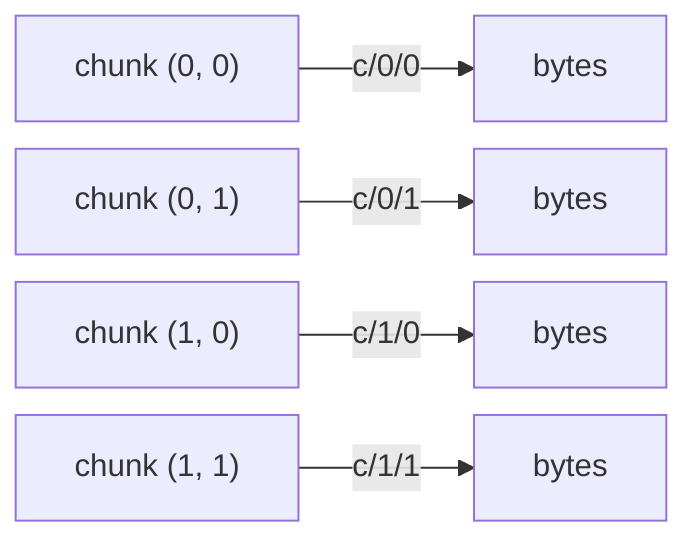

# Part I: The core idea

*The happy path, with pictures and no code.* This is the first part of the
[From Zero to Zarr](data_model.md) guide.

## An overview of arrays

The thing Zarr stores is an **array**: a grid of values that all share a single
**data type** (almost always shortened to **dtype**, the term we'll use from here
on), arranged by a **shape**.

Here is a small array with **4 rows and 6 columns** of 32-bit integers (we use a
non-square shape on purpose, so "rows" and "columns" are never ambiguous):

<figure>
<table>
<tr><td>0</td><td>1</td><td>2</td><td>3</td><td>4</td><td>5</td></tr>
<tr><td>6</td><td>7</td><td>8</td><td>9</td><td>10</td><td>11</td></tr>
<tr><td>12</td><td>13</td><td>14</td><td>15</td><td>16</td><td>17</td></tr>
<tr><td>18</td><td>19</td><td>20</td><td>21</td><td>22</td><td>23</td></tr>
</table>
<figcaption><code>shape = (4, 6)</code> (4 rows, 6 columns); <code>dtype = int32</code> (every value is a 32-bit integer).</figcaption>
</figure>

A few terms we'll use throughout:

- **dtype**: every element has the *same* type. Here it's a 32-bit integer, so
  each value takes exactly 4 bytes. A uniform type means the computer knows
  precisely how many bytes each value occupies, and where each one lives.
- **shape**: the size along each dimension. Ours is `(4, 6)`: the first number is
  rows, the second is columns.
- **ndim**: the number of dimensions (axes). Ours is 2. Arrays can be 0-D, 1-D,
  2-D, 3-D, or more.

## Why "contiguous memory" matters

That grid is a convenient *picture*. Underneath, the array is **one contiguous
block of memory**: a single run of bytes, with the values laid out **row by row**
(row 0, then row 1, and so on). This is called **row-major**, or **C order**
("C" because the C programming language lays out arrays this way, and NumPy follows
the same convention by default). The alternative is **column-major**, or **F order**
("F" for Fortran, which stores arrays column by column); a few tools, such as
MATLAB and R, use it. The two simply disagree on which direction to walk the grid
when flattening it into memory. Zarr's default is C order.

<figure>
<table>
<tr>
<td>0</td><td>1</td><td>2</td><td>3</td><td>4</td><td>5</td><td style="opacity:0.5">&hellip;</td><td>18</td><td>19</td><td>20</td><td>21</td><td>22</td><td>23</td>
</tr>
</table>
<figcaption>The same 24 values as they actually sit in memory: row 0 (0–5) comes first, immediately followed by row 1 (6–11), then row 2, then row 3 (18–23), all back to back. (The middle is elided here.)</figcaption>
</figure>

This layout is not just trivia; it has real consequences:

- Reading a **whole row** is fast: the values are already next to each other, so
  it's one smooth sequential scan of memory.
- Reading a **whole column** is slower: the values are far apart (column 0 is at
  positions 0, 6, 12, 18), so the computer has to hop around in a *strided* access
  that is much less friendly to memory and caches.

Keep this in mind. The fact that an array is a contiguous, row-major block is
exactly what Zarr has to wrestle with once we start chopping arrays into pieces.

## Slicing

To read part of an array, you **slice** it, selecting a rectangular region.
Asking for rows 1–2 and columns 2–4, which Python and NumPy write as `a[1:3, 2:5]`,
picks out the shaded block:

<figure>
<table>
<tr><td>0</td><td>1</td><td>2</td><td>3</td><td>4</td><td>5</td></tr>
<tr><td>6</td><td>7</td><td style="background:var(--md-code-bg-color)"><strong>8</strong></td><td style="background:var(--md-code-bg-color)"><strong>9</strong></td><td style="background:var(--md-code-bg-color)"><strong>10</strong></td><td>11</td></tr>
<tr><td>12</td><td>13</td><td style="background:var(--md-code-bg-color)"><strong>14</strong></td><td style="background:var(--md-code-bg-color)"><strong>15</strong></td><td style="background:var(--md-code-bg-color)"><strong>16</strong></td><td>17</td></tr>
<tr><td>18</td><td>19</td><td>20</td><td>21</td><td>22</td><td>23</td></tr>
</table>
<figcaption><code>a[1:3, 2:5]</code> selects the shaded region (rows 1–2, columns 2–4).</figcaption>
</figure>

That `start:stop` bracket notation is Python and NumPy's; other languages and Zarr
implementations express the same idea with their own syntax (Rust's `s![1..3, 2..5]`,
for instance). The notation isn't part of Zarr; what matters here is the universal
*concept*: picking out a sub-region of the array.

## When an array outgrows memory

The catch with an in-memory array is right there in the name: it lives in memory,
and memory runs out. As we saw, real datasets are routinely **too big to fit in
RAM**, need to **outlive the program that created them**, and must be **shared** so
others can read even a single corner without copying the whole thing.

An array that large is never held in memory all at once; it's written out a piece
at a time (more on that in [Part II](data_model_under_the_hood.md)). To make that possible, Zarr starts with
one simple idea: don't store the array as a single blob. Split it up.

## Chunking: splitting the grid into blocks

To store an array that may be enormous, Zarr first cuts the grid into a
[regular grid of equal-sized blocks](https://zarr-specs.readthedocs.io/en/latest/v3/chunk-grids/regular-grid/index.html)
called **chunks**. You choose the **chunk shape**: the shape of one block.

Let's chunk our 4×6 array with a chunk shape of `(2, 3)`: 2 rows by 3 columns.
That divides it evenly into four chunks. Crucially, the chunks aren't a flat list:
they tile the array, so they form a grid of their own, the **chunk grid**. Here
the chunk grid has shape `(2, 2)`: two rows and two columns *of chunks*. Notice the
position labels match the original array: chunk `(0, 1)` sits top-right, holding
the array's top-right block:

<figure>

<table><tr><td>0</td><td>1</td><td>2</td></tr><tr><td>6</td><td>7</td><td>8</td></tr></table>
<small>chunk (0, 0)</small>

<table><tr><td>3</td><td>4</td><td>5</td></tr><tr><td>9</td><td>10</td><td>11</td></tr></table>
<small>chunk (0, 1)</small>

<table><tr><td>12</td><td>13</td><td>14</td></tr><tr><td>18</td><td>19</td><td>20</td></tr></table>
<small>chunk (1, 0)</small>

<table><tr><td>15</td><td>16</td><td>17</td></tr><tr><td>21</td><td>22</td><td>23</td></tr></table>
<small>chunk (1, 1)</small>

<figcaption>A <code>(4, 6)</code> array with chunk shape <code>(2, 3)</code> forms a <strong>chunk grid</strong> of shape <code>(2, 2)</code>. Don't confuse the two: the <em>chunk shape</em> <code>(2, 3)</code> is the size of each block; the <em>chunk grid shape</em> <code>(2, 2)</code> is how many blocks there are along each axis.</figcaption>
</figure>

Chunking is the key move. Each chunk can be stored, loaded, and compressed on its
own, so a program can read just the chunks it needs (that one corner your
colleague wanted) without touching the rest.

!!! note
    We deliberately chose a chunk shape that divides the array evenly. But if every
    chunk has a fixed shape, how can chunks represent an array whose size *isn't*
    evenly divisible by the chunk shape? We answer that in
    [when chunks don't divide evenly](data_model_under_the_hood.md#going-deeper-when-chunks-dont-divide-evenly).

## A store is just keys and bytes

Where do the chunks go? Into a **store**. According to the
[Zarr specification](https://zarr-specs.readthedocs.io/en/latest/v3/core/index.html#stores),
a store is simply *a mapping from keys to values*, where a **key** is a text
string and a **value** is a sequence of **bytes**. In other words, a store is
basically a dictionary: hand it a key, get back some bytes.

That abstraction is deliberately humble, because lots of things can play the role
of a store: a **directory on your disk** (keys are file paths), an **object-storage
bucket** like Amazon S3 (keys are object names), a **ZIP file**, or even plain
memory. Zarr treats them all the same way.

Each cell of the **chunk grid** becomes one value in the store, under a key built
from the cell's position. So the four chunk-grid cells become four key→bytes
entries, one per cell:

<figure markdown="1" class="mermaid-figure">

<figcaption>Each cell of the chunk grid is stored as <strong>bytes</strong> under a key built from its row and column, like <code>c/0/1</code>.</figcaption>

</figure>

Where does a key like `c/0/1` come from? Each array's metadata picks a **chunk key
encoding**: a rule for turning a chunk's grid position into a key. The default
([*chunk key encoding*](https://zarr-specs.readthedocs.io/en/latest/v3/chunk-key-encodings/default/index.html))
works like this: start with the literal prefix **`c`** (short for "chunk"), then
append the chunk's grid indices, one per dimension, separated by `/`. So the chunk
in grid row&nbsp;1, column&nbsp;0 becomes `c/1/0`; for a 3-D array, a chunk at grid
position `(2, 0, 1)` becomes `c/2/0/1`. The separator is configurable (`.` is the
other common choice), and (as we'll see next) the array records which scheme it
uses, so any reader reconstructs exactly the same keys.

That's the whole trick: a big array becomes a handful of key/value entries that
any storage system capable of "save these bytes under this name" can hold.

## Metadata: making the bytes meaningful

A pile of chunk blobs is meaningless on its own. If all you have is the bytes
under `c/0/1`, how would you know they're 32-bit integers, how big the array is,
or how the chunks tile together?

Zarr answers this with **metadata**: a small JSON document, stored in the same
store under the key `zarr.json`, that describes the array. Among its
[fields](https://zarr-specs.readthedocs.io/en/latest/v3/core/index.html#array-metadata):

- [`shape`](https://zarr-specs.readthedocs.io/en/latest/v3/core/index.html#array-metadata-shape): the array's overall shape, e.g. `[4, 6]`.
- [`data_type`](https://zarr-specs.readthedocs.io/en/latest/v3/core/index.html#array-metadata-data-type): the dtype, e.g. `int32`.
- [`chunk_grid`](https://zarr-specs.readthedocs.io/en/latest/v3/core/index.html#array-metadata-chunk-grid): how the array is divided into a regular grid of chunks. Nested
  inside it is the **`chunk_shape`**, the shape of a *single* chunk, e.g.
  `[2, 3]`. (Note the *number* of chunks along each axis, the chunk grid's own
  shape (`2 × 2` here), isn't stored; it's computed from the array shape and the
  chunk shape.)
- [`chunk_key_encoding`](https://zarr-specs.readthedocs.io/en/latest/v3/core/index.html#array-metadata-chunk-key-encoding): the rule that turns chunk positions into keys (the `c/0/1` scheme just
  described, including the separator).
- [`fill_value`](https://zarr-specs.readthedocs.io/en/latest/v3/core/index.html#fill-value): the value for parts of the array that were never written (the
  spec calls these "uninitialised portions"). More on this in
  [Part II](data_model_under_the_hood.md#going-deeper-when-chunks-dont-divide-evenly).
- [`codecs`](https://zarr-specs.readthedocs.io/en/latest/v3/core/index.html#array-metadata-codecs): the **codecs** (a *codec* is a coder/decoder: it encodes a chunk's
  values into stored bytes, and decodes them back) used to turn each chunk's values
  into the bytes saved in the store. More on this in
  [Part II](data_model_under_the_hood.md#going-deeper-codecs-how-values-become-bytes).

The metadata is the legend that turns anonymous bytes back into your array. We'll
look at a *real* `zarr.json` in [Part III](data_model_in_action.md).

## The role of the specification

Here's the part that surprises newcomers: **none of that layout (the `zarr.json`
fields, the `c/0/1` key names, the way chunks are encoded) was invented by any
particular library.** It is defined by the
[**Zarr specification**](https://zarr-specs.readthedocs.io/en/latest/v3/core/index.html),
a written, public standard.

Because the format is specified independently of any one library, **any**
implementation can read and write it. An array written from Python can be read by
an implementation in Rust, JavaScript, or C++, because they all agree on the same
spec. This page's examples use [zarr-python](https://github.com/zarr-developers/zarr-python),
but the same data is understood by [zarrs](https://github.com/zarrs/zarrs)
(Rust), [zarrita.js](https://github.com/manzt/zarrita.js) (JavaScript),
[TensorStore](https://google.github.io/tensorstore/) (C++), and more.

You can read the standard at
[zarr-specs.readthedocs.io](https://zarr-specs.readthedocs.io). These examples use
**Zarr format 3**, the current default. An older format,
[version 2](https://zarr-specs.readthedocs.io/en/latest/v2/v2.0.html), uses a
slightly different on-disk layout; see the [v3 migration guide](v3_migration.md)
if you meet it.

---

That's the whole happy path. Continue to
**[Part II: Under the hood](data_model_under_the_hood.md)** for the machinery
behind it, or skip straight to
**[Part III: Seeing it for real](data_model_in_action.md)** to watch it run.
