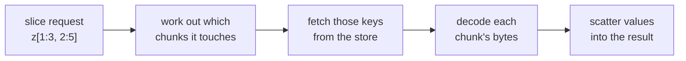

# Part III: Seeing it for real

*A short hands-on section with runnable code.* This is the final part of the
[From Zero to Zarr](data_model.md) guide, tying together
[Part I: The core idea](data_model_core_idea.md) and
[Part II: Under the hood](data_model_under_the_hood.md).

Enough concepts: let's watch the machinery run. We'll create the exact `(4, 6)`
array chunked at `(2, 3)` from [Part I](data_model_core_idea.md), then inspect
what Zarr actually wrote.

First, create the array:

```python exec="true" session="datamodel"
import shutil

# start clean so the example is reproducible
shutil.rmtree("data/understanding-zarr.zarr", ignore_errors=True)
```

```python exec="true" session="datamodel" source="above" result="code"
from pathlib import Path

import numpy as np
import zarr

z = zarr.create_array(
    store="data/understanding-zarr.zarr",
    shape=(4, 6),
    chunks=(2, 3),
    dtype="int32",
)
print(type(z))
```

Notice what `z` is: a **Zarr array**, *not* a NumPy array. It's a lightweight handle
onto the store; there aren't 24 integers sitting in memory. And `create_array` has
so far written **only metadata**: no chunk data at all. We can prove that by listing
everything in the store:

```python exec="true" session="datamodel" source="above" result="code"
def show_store():
    root = Path("data/understanding-zarr.zarr")
    for path in sorted(root.rglob("*")):
        if path.is_file():
            print(path.relative_to(root))

show_store()
```

Just `zarr.json`: the metadata, and not a single chunk. Here is what it holds:

```python exec="true" session="datamodel" source="above" result="json"
import json

metadata = Path("data/understanding-zarr.zarr/zarr.json").read_text()
print(json.dumps(json.loads(metadata), indent=2))
```

Every concept from Part I is right there: the `shape`, the `chunk_grid` (with
its nested `chunk_shape`), the `data_type`, the `chunk_key_encoding` that produces
`c/0/1`-style keys, the `fill_value`, and the `codecs` pipeline.

The dump also carries a few fields we haven't dwelt on.
[`zarr_format`](https://zarr-specs.readthedocs.io/en/latest/v3/core/index.html#array-metadata-zarr-format)
and
[`node_type`](https://zarr-specs.readthedocs.io/en/latest/v3/core/index.html#array-metadata-node-type)
are housekeeping: the Zarr format version (3) and whether this node is an array or
a group. `attributes` is a slot for your own custom metadata, such as names, units,
or descriptions (see [Attributes](attributes.md)). And
[`storage_transformers`](https://zarr-specs.readthedocs.io/en/latest/v3/core/index.html#storage-transformers)
is an optional, advanced extension point: where a codec transforms an *individual
chunk*, a storage transformer sits between the *whole array* and the store, able to
transform how data is read from and written to it. No storage transformers are
standardised yet, so zarr-python writes an empty list (`[]`); you can safely ignore
it for now.

Now let's actually store some data. zarr-python deliberately mirrors NumPy's
**indexing and slicing syntax**: you write into the array by assigning to a slice,
just as you would with NumPy. **That assignment is what triggers Zarr to encode
chunks and write their bytes.** Creation set up the metadata, but only writing puts
chunk data in the store:

```python exec="true" session="datamodel" source="above" result="code"
# the same 4x6 grid of integers from Part I
source = np.arange(24).reshape(4, 6)

z[:] = source  # assigning to a slice writes chunk bytes to the store

show_store()
```

Now the four chunk values (`c/0/0` … `c/1/1`) have appeared alongside `zarr.json`,
one object per cell of our 2×2 chunk grid, exactly as the diagrams promised. The
metadata was written at creation; the chunk bytes were written only just now, by the
assignment.

Finally, reading: again using ordinary Python indexing. When you ask for a slice,
zarr-python does the reverse of everything in
[Part II](data_model_under_the_hood.md):

<figure markdown="1" class="mermaid-figure">



<figcaption>Reading a slice reverses the write path: Zarr finds which chunks the slice touches, fetches just those keys, decodes them, and scatters the values into the result.</figcaption>

</figure>

It works out which chunks the slice overlaps, fetches only those keys, decodes
their bytes, and scatters the values into the result, which comes back as an
ordinary NumPy array. The round-trip matches the original data:

```python exec="true" session="datamodel" source="above" result="code"
opened = zarr.open_array("data/understanding-zarr.zarr", mode="r")
corner = opened[1:3, 2:5]  # ordinary slicing, just like NumPy
print(corner)
print("matches NumPy:", bool((corner == source[1:3, 2:5]).all()))
```

And here's the real payoff of everything this page has argued. We wrote that store
with zarr-python, but nothing about it is Python-specific: it's just the keys, bytes,
and `zarr.json` that the **specification** prescribes. So the *exact same directory*
can be opened, unchanged, by a Zarr implementation in another language: by
[zarrs](https://github.com/zarrs/zarrs) from Rust, by
[zarrita.js](https://github.com/manzt/zarrita.js) from JavaScript in a browser, or by
[TensorStore](https://google.github.io/tensorstore/) from C++, each reading the same
chunks and reconstructing the same array. That portability isn't a feature
zarr-python adds; it's what *being a specification* means.

## Recap, and where to go next

You now have the whole mental model:

- An **array** is a grid of equally-typed values with a **shape**, stored in
  memory as one contiguous, row-major block.
- Zarr splits it into equal-shaped **chunks**.
- Chunks live in a **store** as **keys mapped to bytes** (a folder, a bucket, a
  zip, memory).
- A **metadata** document (`zarr.json`) describes the array so the bytes mean
  something.
- The layout is fixed by the **Zarr specification**, so **any** implementation can
  read it; zarr-python is just one of them.
- Under the hood: chunks are gathered/scattered to and from memory; uneven chunks
  get **fill**-padded edges; **codecs** compress and transform chunk bytes;
  **sharding** bundles inner chunks into shards to avoid too many objects;
  **groups** organize many arrays into a hierarchy; and the whole model scales to
  **any number of dimensions**.

Ready to use it? Continue with:

- [Working with arrays](arrays.md): create, read, and write arrays in
  zarr-python.
- [Groups](groups.md): build and navigate hierarchies.
- [Storage](storage.md): the stores you can put your data in.
- [Optimizing performance](performance.md): choosing chunk and shard shapes.
- [Glossary](glossary.md): quick definitions of chunk, codec, store, and more.
- [Zarr specifications](https://zarr-specs.readthedocs.io): the standard itself.
