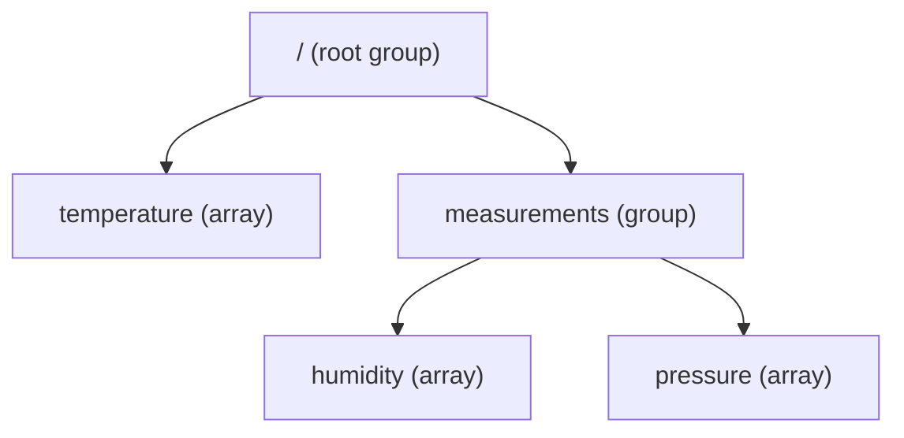

# Part II: Under the hood

*A few deeper sections that go off the happy path.* This is the second part of the
[From Zero to Zarr](data_model.md) guide; it assumes you've read
[Part I: The core idea](data_model_core_idea.md).

You now have the core mental model: arrays become chunks, chunks become key/value
entries, and metadata explains it all, exactly as the spec prescribes. The next
few sections go a little deeper, off the happy path. None of it changes the big
picture; it just explains the machinery. Read on if you're curious; skip to
[Part III](data_model_in_action.md) if you'd rather see it in action.

## Going deeper: how chunks meet memory

Remember that an array lives in memory as one contiguous, row-major block. Here's
the catch: **the values belonging to a single chunk are *not* next to each other
in that block.**

Look again at chunk `(0, 0)`: values `0, 1, 2, 6, 7, 8`. In the array's flat
memory, those sit in two separate runs, because columns 3, 4, 5 of each row fall
in between:

<figure>
<table>
<tr>
<td style="background:var(--md-code-bg-color)"><strong>0</strong></td><td style="background:var(--md-code-bg-color)"><strong>1</strong></td><td style="background:var(--md-code-bg-color)"><strong>2</strong></td><td>3</td><td>4</td><td>5</td><td style="background:var(--md-code-bg-color)"><strong>6</strong></td><td style="background:var(--md-code-bg-color)"><strong>7</strong></td><td style="background:var(--md-code-bg-color)"><strong>8</strong></td><td>9</td><td>10</td><td>11</td><td>12</td><td>…</td>
</tr>
</table>
<figcaption>Chunk (0, 0)'s values (shaded) are split into two runs in the array's flat memory; columns 3–5 lie in between.</figcaption>
</figure>

So writing a chunk isn't a straight copy. Zarr must **gather** the chunk's
scattered values into the chunk's *own* small contiguous block, then encode and
store it. Reading does the reverse: decode the chunk into its compact block, then
**scatter** the values back into the right positions of your result array.

<figure>
<table style="margin:0 auto;text-align:center">
<tr>
<td style="background:var(--md-code-bg-color)"><strong>0</strong></td><td style="background:var(--md-code-bg-color)"><strong>1</strong></td><td style="background:var(--md-code-bg-color)"><strong>2</strong></td><td style="opacity:0.4">3&nbsp;&nbsp;4&nbsp;&nbsp;5</td><td style="background:var(--md-code-bg-color)"><strong>6</strong></td><td style="background:var(--md-code-bg-color)"><strong>7</strong></td><td style="background:var(--md-code-bg-color)"><strong>8</strong></td>
</tr>
</table>
<div style="text-align:center"><small>in the array: chunk (0,0)'s values, split apart by the in-between cells (3, 4, 5)</small></div>
<div style="text-align:center;margin:0.5rem 0"><strong>gather &darr; when writing</strong> &nbsp;&middot;&nbsp; <strong>scatter &uarr; when reading</strong></div>
<table style="margin:0 auto;text-align:center">
<tr>
<td style="background:var(--md-code-bg-color)"><strong>0</strong></td><td style="background:var(--md-code-bg-color)"><strong>1</strong></td><td style="background:var(--md-code-bg-color)"><strong>2</strong></td><td style="background:var(--md-code-bg-color)"><strong>6</strong></td><td style="background:var(--md-code-bg-color)"><strong>7</strong></td><td style="background:var(--md-code-bg-color)"><strong>8</strong></td>
</tr>
</table>
<div style="text-align:center"><small>in the chunk: one contiguous block, which is what gets encoded and stored</small></div>
<figcaption><strong>Gather and scatter.</strong> Writing collects the chunk's scattered values into its own contiguous block (gather); reading runs the mapping in reverse, placing decoded values back at their strided positions in the array (scatter).</figcaption>
</figure>

This gather/scatter isn't stated in the spec; it's a direct **consequence** of
two spec rules working together: chunks form a
[regular grid](https://zarr-specs.readthedocs.io/en/latest/v3/chunk-grids/regular-grid/index.html),
and a chunk's values are
[serialized in row-major order](https://zarr-specs.readthedocs.io/en/latest/v3/codecs/bytes/index.html).
Two practical effects follow, and they're worth remembering when you choose a chunk
shape:

- **Reading amplifies.** To return a slice, Zarr reads *every chunk the slice
  touches*, decodes each one **completely**, and then extracts the part you asked
  for. Ask for a single value in a million-element chunk, and the whole chunk is
  still read and decoded.
- **Unaligned writing is expensive.** If you write a region that doesn't line up
  with chunk boundaries, Zarr must first **read** the affected edge chunks,
  **modify** the overlapping part, and **write** them back (a *read-modify-write*).
  Writing whole, chunk-aligned regions avoids that round trip.

## Going deeper: when chunks don't divide evenly

Our 4×6 array split cleanly into 2×3 chunks. Real arrays rarely cooperate. What if
the array has **5 rows** and we keep a chunk height of **2**?

The chunk grid simply rounds up: 5 rows with a chunk height of 2 gives row-chunks
covering rows 0–1, 2–3, and 4. That last row-chunk only has *one* real row, but,
per the [spec](https://zarr-specs.readthedocs.io/en/latest/v3/chunk-grids/regular-grid/index.html),
**border chunks are always stored at full size**. The cells beyond the array's edge
are unused; the spec *recommends* writing the **fill value** into them.

<figure>
<div style="display:flex;flex-wrap:wrap;gap:1rem;justify-content:center">
<div style="text-align:center">
<table><tr><td>24</td><td>25</td><td>26</td></tr><tr><td style="opacity:0.45">fill</td><td style="opacity:0.45">fill</td><td style="opacity:0.45">fill</td></tr></table>
<small>bottom chunk (2, 0)</small>
</div>
<div style="text-align:center">
<table><tr><td>27</td><td>28</td><td>29</td></tr><tr><td style="opacity:0.45">fill</td><td style="opacity:0.45">fill</td><td style="opacity:0.45">fill</td></tr></table>
<small>bottom chunk (2, 1)</small>
</div>
</div>
<figcaption>The two bottom border chunks of a 5×6 array chunked at <code>(2, 3)</code>: each is stored at full <code>(2, 3)</code> size, with the phantom cells past the array's edge holding the <strong>fill value</strong>.</figcaption>
</figure>

So a 5×6 array chunked at `(2, 3)` quietly stores a row of "phantom" cells holding
the fill value. It's harmless, but it's a small waste, and a good reason to pick a
chunk shape that fits your array's real shape reasonably well. When a shape really
can't fit a regular grid, the
[rectilinear chunk grid extension](https://github.com/zarr-developers/zarr-extensions/tree/main/chunk-grids/rectilinear)
allows chunks of differing sizes. (For practical guidance on choosing chunk shapes,
see [Performance](performance.md).)

## Going deeper: codecs (how values become bytes)

One more thing happens inside each chunk. The bytes stored under `c/0/1` aren't
necessarily the raw values; they're produced by a **codec pipeline**, a small
ordered assembly line recorded in the metadata. The
[specification](https://zarr-specs.readthedocs.io/en/latest/v3/core/index.html#codecs)
defines three kinds of codec, applied in this order:

1. **array → array** codecs (optional, any number): rearrange or transform the values; e.g. a
   [*transpose* codec](https://zarr-specs.readthedocs.io/en/latest/v3/codecs/transpose/index.html)
   changes their order.
2. **array → bytes** codec (exactly one, always required): turns the array of
   values into a flat sequence of bytes. By default
   ([the `bytes` codec](https://zarr-specs.readthedocs.io/en/latest/v3/codecs/bytes/index.html))
   it writes them in lexicographical order, which the spec notes *is* C / row-major
   order.
3. **bytes → bytes** codecs (optional, any number): transform the bytes; e.g.
   **compression** to shrink them, or a checksum to detect corruption.

Because the metadata records the exact pipeline, any spec-compliant reader knows
precisely how to run it in reverse and **decode** a chunk back into values.
Per-chunk compression is a big part of why Zarr can store enormous arrays
efficiently while staying readable everywhere.

## Going deeper: sharding (when there are too many chunks)

So far, **each chunk has been its own store object**: one key, one value. That's
simple, but it has a limit: small chunks in a very large array produce a *huge*
number of chunks, and therefore a huge number of files or objects. The spec notes
this is exactly where file systems (block sizes, inode limits) and object stores
start to struggle. On object storage the limit is often about cost as much as
performance: many providers bill per request, so millions of tiny objects mean
millions of billable operations.

**Sharding** is the fix, and it adds one layer to the picture. Instead of writing
every chunk as a separate object, Zarr can pack a block of neighboring chunks into
a single store object called a **shard**. Inside a shard, the chunks are written
one after another, followed by an **index** recording each chunk's byte offset and
length. That index is the clever part: because the store knows exactly where each
chunk sits, a reader can still pull out a *single* chunk without decoding the whole
shard. The chunk shape must divide the shard shape evenly, so a shard always holds
a whole number of chunks. The layering becomes
**array → shards (one object per store key) → chunks**:

<figure>

<div style="text-align:center;margin-bottom:0.4rem"><small><strong>one shard</strong> = one store key (e.g. <code>c/0/0</code>)</small></div>

<table style="margin:0 auto;text-align:center">
<tr><td style="padding:0.45rem 2.5rem">chunk</td></tr>
<tr><td style="padding:0.45rem 2.5rem">chunk</td></tr>
<tr><td style="padding:0.45rem 2.5rem">chunk</td></tr>
<tr><td style="padding:0.45rem 2.5rem">chunk</td></tr>
<tr><td style="padding:0.45rem 2.5rem;background:var(--md-code-bg-color)"><strong>index</strong>: offset + length of each chunk</td></tr>
</table>

<figcaption>A <strong>shard</strong> is a single store object: neighboring chunks are packed one after another, followed by an <strong>index</strong> recording each chunk's byte offset and length.</figcaption>

</figure>

!!! note "The shard truth"
    Sharding gives you the best of both worlds: **far fewer objects** in the
    store, but still **fine-grained, single-chunk reads** within them. The one
    thing to keep straight is what now occupies a single store object: *without*
    sharding, one **chunk** is one stored object; *with* sharding, the stored
    object is the **shard**, and chunks become pieces *inside* it. In zarr-python
    you set both shapes explicitly: `chunks=` for the small pieces and `shards=`
    for the bundle. (The formal
    [specification](https://zarr-specs.readthedocs.io/en/latest/v3/codecs/sharding-indexed/index.html)
    calls those small pieces *inner chunks*; this page just calls them chunks, but
    they're the same thing.) You'll also hear *"shards are the unit of writing,
    chunks are the unit of reading"*. That's handy guidance, though the spec only
    defines the on-disk layout that makes partial reads possible, not a hard rule
    about write granularity.

Where does all this get recorded? Reassuringly, sharding adds **no new metadata
files**: the array still has its single `zarr.json`. Sharding is simply one of the
**codecs** from the previous section: a
[`sharding_indexed`](https://zarr-specs.readthedocs.io/en/latest/v3/codecs/sharding-indexed/index.html)
codec in the array's `codecs` list. The array's chunk shape in `chunk_grid` becomes the *shard* shape
(the unit that maps to one store key), while the *inner* chunk shape sits inside
that codec's own configuration. The shard's **index** (the offsets and lengths
that locate each inner chunk) isn't in `zarr.json` at all; it's written *inside
each shard object itself*, as a small footer (by default at the end). So `zarr.json`
describes *how* shards are built, and every shard then carries its own little map to
the chunks within it.

So in `zarr.json` there's nothing new to learn: sharding is just one more entry in
the array's `codecs` list, a `sharding_indexed` codec that looks roughly like this:

```json
{
  "name": "sharding_indexed",
  "configuration": {
    "chunk_shape": [2, 3],
    "codecs": [ ... ],
    "index_codecs": [ ... ],
    "index_location": "end"
  }
}
```

Two parts are worth recognising. The inner `chunk_shape` is the size of the chunks
packed inside each shard. And `index_location` tells a reader **where in the shard
to find the index**: `"end"` means the footer described above (it can also be
`"start"`). The elided `codecs` and `index_codecs` lists simply record how the
chunks and the index itself are encoded. Because the `sharding_indexed` codec is
part of the **Zarr specification**, any implementation that understands it can open
the shard.

And the index inside a shard is, logically, just a small table: one row per inner
chunk, giving where that chunk starts and how long it is:

<figure>
<table style="margin:0 auto;text-align:center">
<tr><th>inner chunk</th><th>byte offset</th><th>byte length</th></tr>
<tr><td>(0, 0)</td><td>0</td><td>33</td></tr>
<tr><td>(0, 1)</td><td>33</td><td>33</td></tr>
<tr><td>(1, 0)</td><td>66</td><td>33</td></tr>
<tr><td>(1, 1)</td><td>99</td><td>33</td></tr>
</table>
<figcaption>A shard's index (illustrative offsets/lengths). One entry per inner chunk lets a reader fetch just the chunk it wants. The spec defines this index (including that it sits, by default, in a footer at the end of the shard), so every implementation locates a chunk the same way.</figcaption>
</figure>

For the hands-on side of sharding, see
[Sharding in the array guide](arrays.md#sharding).

## Going deeper: groups (organizing many arrays)

Real datasets usually hold more than one array. Because store keys are just
strings, they can contain `/`, which lets Zarr nest things into a **hierarchy**,
much like folders and files. A **group** is a node that can contain arrays and
other groups.

<figure markdown="1" class="mermaid-figure">



<figcaption>A small Zarr <strong>hierarchy</strong>: a root group holding an array (<code>temperature</code>) and a subgroup (<code>measurements</code>), which itself holds two arrays.</figcaption>

</figure>

Here's the key insight: there are **no real folders**. The hierarchy is an
illusion created entirely by the **key names**. Every node (each group and each
array) has its own `zarr.json` under a key prefixed by its path, and an array's
chunk keys carry the same prefix. The tree above is just these flat keys in the
store:

```text
zarr.json                              ← root group metadata
temperature/zarr.json                  ← array metadata
temperature/c/0/0                      ← a chunk of "temperature"
temperature/c/0/1
measurements/zarr.json                 ← subgroup metadata
measurements/humidity/zarr.json        ← array metadata
measurements/humidity/c/0/0            ← a chunk of "humidity"
measurements/pressure/zarr.json
measurements/pressure/c/0/0
```

Reading `measurements/humidity` just means looking up the keys that start with that
prefix. So nothing new is needed to support hierarchies: the same simple rules
(keys, bytes, and metadata) scale from a single array up to a richly structured
dataset, and they map just as naturally onto a flat object store (where keys never
were folders) as onto a directory on disk. See [Groups](groups.md) to work with
them.

## Going deeper: more than two dimensions

We've stayed in 2-D to keep the pictures simple, but **nothing about Zarr is limited
to two dimensions**: the whole model scales to any number of axes, with one more
index at each step. An *N*-dimensional array's `shape` and chunk shape each gain an
axis, its chunk grid becomes *N*-dimensional, and each chunk key carries *N*
indices. The store, the metadata, and the codecs are all unchanged.

This matters because real data is *usually* more than 2-D. A short video clip is
3-D (frames × height × width); an RGB image is 3-D (height × width × colour
channel); a microscope scan or a CT volume is a stack of 2-D slices; and a climate
field recorded over time is (time × latitude × longitude). Many datasets have four
or more axes.

To see the generalisation concretely, picture a 3-D array as a **stack of 2-D
arrays**. Here are two 4×6 layers stacked into a `(2, 4, 6)` array (think of them
as two time steps):

<figure>
<div style="display:flex;flex-wrap:wrap;gap:1.5rem;justify-content:center">
<div style="text-align:center">
<table>
<tr><td>0</td><td>1</td><td>2</td><td>3</td><td>4</td><td>5</td></tr>
<tr><td>6</td><td>7</td><td>8</td><td>9</td><td>10</td><td>11</td></tr>
<tr><td>12</td><td>13</td><td>14</td><td>15</td><td>16</td><td>17</td></tr>
<tr><td>18</td><td>19</td><td>20</td><td>21</td><td>22</td><td>23</td></tr>
</table>
<small>layer 0</small>
</div>
<div style="text-align:center">
<table>
<tr><td>24</td><td>25</td><td>26</td><td>27</td><td>28</td><td>29</td></tr>
<tr><td>30</td><td>31</td><td>32</td><td>33</td><td>34</td><td>35</td></tr>
<tr><td>36</td><td>37</td><td>38</td><td>39</td><td>40</td><td>41</td></tr>
<tr><td>42</td><td>43</td><td>44</td><td>45</td><td>46</td><td>47</td></tr>
</table>
<small>layer 1</small>
</div>
</div>
<figcaption>Two 4×6 layers stacked into a <code>(2, 4, 6)</code> array (think of them as two time steps).</figcaption>
</figure>

Everything you've already learned carries straight over, just with that extra index:

- **Chunk shape** gains an axis. A chunk shape of `(1, 2, 3)` keeps each layer
  separate (depth 1) and splits each layer into the same 2×3 blocks as before.
- The **chunk grid** is now 3-D: shape `(2, 2, 2)`, two layers × two chunk-rows ×
  two chunk-columns = **eight** chunks.
- **Keys** gain an index. The chunk at grid position `(layer, row, col) = (1, 0, 1)`
  is stored under the key `c/1/0/1`.
- **Slicing** gains an index too: `a[0]` selects the whole first layer, and
  `a[0, 1:3, 2:5]` selects a region within it.

Adding dimensions changes the *numbers* (more entries in the shape, more indices in
each key) but not the *model*. And these higher-dimensional arrays are often
exactly the ones too big for memory, which brings us to the last piece.

## Going deeper: working with data bigger than memory

Back to the question from [Part I](data_model_core_idea.md#when-an-array-outgrows-memory): how do you handle an array that's too big
for RAM? The answer falls out of everything above. Creating a Zarr array doesn't
allocate the whole thing; it just writes the metadata and prepares an (empty)
store. You then fill the array **a region at a time**, and each write only needs
*that region* in memory:

- read or generate one block of data (say, a few chunks' worth),
- write it to the corresponding slice of the array,
- discard it, and move on to the next block.

Because you only need to hold one block in memory at a time, the array on disk
can be far larger than your RAM. Writing **chunk-aligned** blocks keeps each write cheap (no
read-modify-write, as we saw earlier). This is also how data streaming in from
instruments or simulations gets persisted: block by block, as it arrives. Tools
like [Dask](https://www.dask.org/) automate this, computing and writing many
chunks in parallel. For the practical recipes, see
[Optimizing performance](performance.md) and [Working with arrays](arrays.md).

---

That's the machinery. Continue to
**[Part III: Seeing it for real](data_model_in_action.md)** to watch it all run
on a real array.
